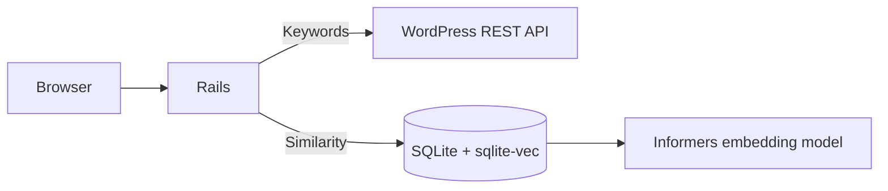

# Article Storage

<p align="left">
  <a href="https://github.com/mykhailo-zhar/article-storage/actions/workflows/ci.yml">
    
  </a>
  <a href="https://www.ruby-lang.org/">
    
  </a>
  <a href="https://rubyonrails.org/">
    
  </a>
  <a href="https://www.sqlite.org/">
    
  </a>
  <a href="https://hotwired.dev/">
    
  </a>
  <a href="https://rspec.info/">
    
  </a>
  <a href="https://www.docker.com/">
    
  </a>
  <a href="https://kamal-deploy.org/">
    
  </a>
  <a href="LICENSE">
    
  </a>
</p>

A read-only Rails app for browsing and searching articles from a WordPress blog. Keyword search queries the WordPress REST API in real time; similarity search finds related posts using vector embeddings stored locally in SQLite.

## Features

- **Keyword search** — queries the WordPress REST API with full-text search, category filters, and pagination
- **Similarity search** — semantic search over locally stored articles using cosine similarity on 384-dimensional embeddings
- **Category filtering** — hierarchical categories mapped from WordPress, with per-group radio filters
- **HTML and JSON** — browse in the browser or consume results as JSON
- **Read-only by design** — create, update, and delete actions return `403 Forbidden`
- **Safe external links** — WordPress URLs are validated and sanitized before rendering

## How it works



| Mode | Data source | Best for |
|------|-------------|----------|
| **Keywords** | WordPress REST API | Live search across all published posts |
| **Similarity** | Local SQLite database | Finding semantically related articles from indexed content |

Similarity search uses [Informers](https://github.com/ankane/informers) with the `sentence-transformers/all-MiniLM-L6-v2` model and [Neighbor](https://github.com/ankane/neighbor) backed by [sqlite-vec](https://github.com/asg017/sqlite-vec). Articles must exist in the local database with precomputed embeddings.

## Tech stack

- **Ruby** 4.0.5 · **Rails** 8.1
- **SQLite** with sqlite-vec for vector search
- **Hotwire** (Turbo + Stimulus) and Propshaft
- **Solid Cache**, **Solid Queue**, **Solid Cable**
- **RSpec**, RuboCop, Brakeman, bundler-audit
- **Docker** and [Kamal](https://kamal-deploy.org/) for deployment

## Requirements

- Ruby 4.0.5 ([mise](https://mise.jdx.dev/) is supported — see `mise.toml`)
- Bundler
- A WordPress site with the REST API enabled (for keyword search)

## Getting started

### 1. Clone and install

```bash
git clone https://github.com/mykhailo-zhar/article-storage.git
cd article-storage
bin/setup --skip-server
```

### 2. Configure environment variables

Keyword search requires two environment variables:

| Variable | Description | Example |
|----------|-------------|---------|
| `WORDPRESS_BLOG_API_URL` | WordPress posts REST endpoint | `https://example.com/wp-json/wp/v2/posts` |
| `WORDPRESS_BLOG_URL` | Base URL used to build article links | `https://example.com/blog/` |

Export them in your shell or add them to your preferred env manager before starting the server.

### 3. Run the server

```bash
bin/dev
```

Visit [http://localhost:3000](http://localhost:3000). Use the header navigation to switch between **Keywords** and **Similarity** search.

With [mise](https://mise.jdx.dev/) installed:

```bash
mise run server   # alias: mise s
```

## API

All list endpoints accept the same query parameters and return JSON when requested with `Accept: application/json` or a `.json` suffix.

| Endpoint | Description |
|----------|-------------|
| `GET /articles` | Keyword search (default) |
| `GET /articles/keywords` | Keyword search |
| `GET /articles/similar` | Similarity search |
| `GET /articles/:id` | Single article |

**Query parameters**

| Parameter | Description |
|-----------|-------------|
| `search` | Search query text |
| `page` | Page number (default: 1) |
| `type` | `keywords` or `similar` |
| `categories_<parent_id>[]` | Category ID filter within a parent group |

## Development

```bash
# Run the full local CI suite
bin/ci

# Run tests
bundle exec rspec

# Lint
bin/rubocop

# Security scans
bin/brakeman
bin/bundler-audit
```

Useful mise tasks: `mise run test` (`t`), `mise run console` (`c`), `mise run debug` (`d`).

## Deployment

The app ships with a production Dockerfile and Kamal configuration.

```bash
# Build the image (pre-downloads the embedding model)
docker build -t article_storage .

# Run locally
docker run -d -p 80:80 \
  -e RAILS_MASTER_KEY=<your-master-key> \
  -e WORDPRESS_BLOG_API_URL=<api-url> \
  -e WORDPRESS_BLOG_URL=<blog-url> \
  --name article_storage article_storage
```

For Kamal deployments, edit `config/deploy.yml` and deploy with `bin/kamal deploy`.

## Project structure

```
app/
  controllers/articles_controller.rb   # Read-only article endpoints
  models/                              # Article, Category
  presenters/articles/                 # Index view logic
  services/articles/                   # SearchKeywords, SearchSimilar, SearchFactory
  views/articles/                      # Search UI and article cards
config/
  deploy.yml                           # Kamal deployment config
  initializers/neighbor.rb             # sqlite-vec setup
spec/                                  # RSpec tests
```

## License

This project is licensed under the [MIT License](LICENSE).
